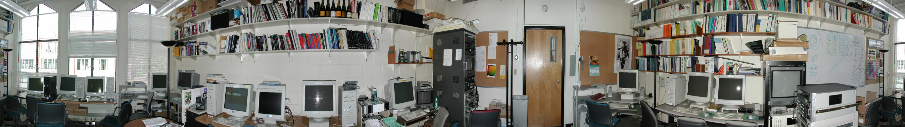

# Image-Stitching
<br />
<p align="center"><i>Panoramic beach-hotel image generated by this project</i></p>

## Introduction
This project is for 2019 Digital Visual Effects Assignment 2 at NTU, where is https://www.csie.ntu.edu.tw/~cyy/courses/vfx/19spring/assignments/proj2/

The purpose of this project is to generate panoramic image from multiple photographs with overlapping fields of view.

## Build
This project is written in C++17, first check if your compiler supports it.

### Dependency
* OpenCV: 3.0+

### Windows + MSVC
Just use standard cmake GUI to build it.

### Linux
Follow steps below (make sure you are in the root directory of this project):

```
$ mkdir build
$ cd build
$ cmake ../
$ make
```

## Usage
- Use following command for more information:

  ```
  $ Image-Stitching -h
  ```

- There are also some controllable MACRO configurations in the `./source/config.h` file.
- Result image will be stored in the `./result/` folder.

## License
This project is under the [MIT](https://opensource.org/licenses/MIT) license.

It also includes some test data in the `./data/` folder, which are downloaded from the course website.

## Gallery
Here are some results generated by this project.

<br />
<p align="center"><i>Panoramic parrington</i></p>
<br />
<p align="center"><i>Panoramic grail</i></p>